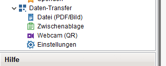
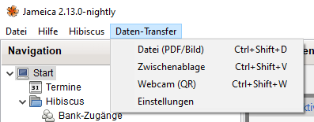
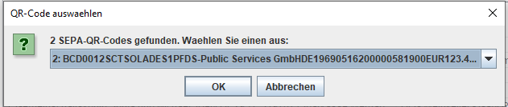
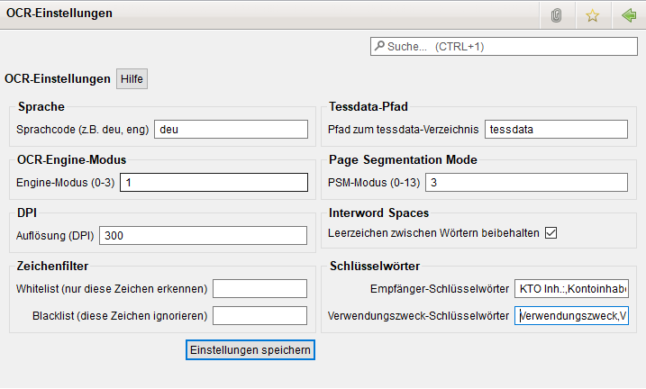
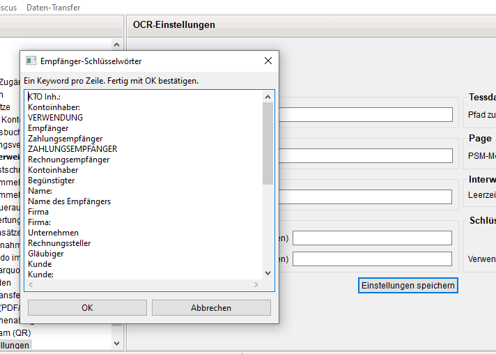
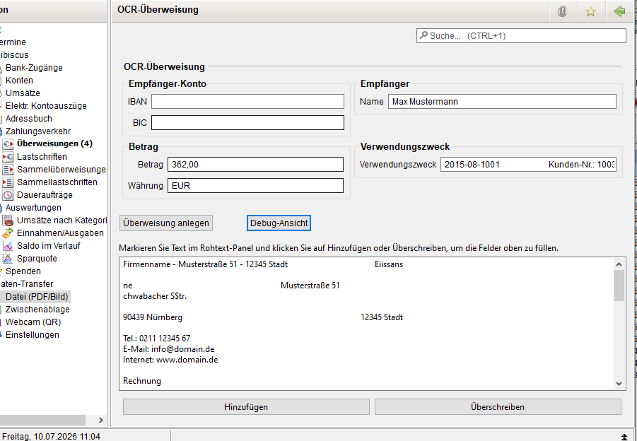
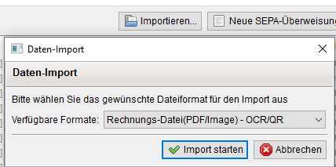

# SEPA Data Transfer Plugin for Jameica/Hibiscus

[Deutsche Version](README_de.md)

**Successor and fusion of the QRtransfer and OCRtransfer plugins.** This plugin replaces both individual plugins and provides a unified interface for all payment data imports.

A combined Jameica/Hibiscus plugin for reading SEPA payment data from QR codes and OCR (invoices), with automatic source type detection.

## What This Plugin Replaces

| Old Plugin | Function | Status |
|-----------|----------|--------|
| **QRtransfer** | QR code import (EPC/EMV) | ❌ No longer needed |
| **OCRtransfer** | OCR import (invoices) | ❌ No longer needed |
| **DataTransfer** | Both in one + Import dialog | ✅ This plugin |

## Features

### Why This Plugin Is Better Than Individual Plugins

- **One plugin instead of two**: Install once, instead of installing QRtransfer AND OCRtransfer separately
- **Automatic detection**: No manual selection needed - the plugin automatically detects QR code or OCR
- **Hibiscus Import Dialog**: Appears directly in Hibiscus's import menu ("Invoice File (PDF/Image) - OCR/QR")
- **Review dialog**: Data can be reviewed and corrected before saving
- **Unified settings**: Keyword search for both modes in one settings view



### Input Methods

- **File** - Load PDF invoices or image files (PNG, JPG, BMP, TIFF)
- **Clipboard** - Read images directly from clipboard
- **Webcam** - Scan QR codes live with camera



### QR Code Support

- EPC (BCD) format - European Payment Council standard format
- EMV (TLV) format - EMV standard from payment terminals
- Multi-QR detection: Automatically find and select multiple QR codes in a PDF



### OCR Support

- Tesseract 5.5.2 (via tess4j 5.19.0)
- PDF text extraction (direct and OCR fallback)
- Configurable OCR settings (OEM, PSM, DPI, language, whitelist/blacklist)



### Keywords

- Recipient keywords: Automatic detection of recipient name
- Purpose keywords: Automatic detection of payment purpose
- Case-insensitive search
- Extended editor with double-click (line-by-line input)



### SEPA Transfer

Direct creation of transfer drafts in Hibiscus



### Additional Features

- **Settings**: Help button with detailed explanation of all options
- **Internationalization**: Full German and English language support

## Requirements

- Jameica 2.10.0+
- Hibiscus 2.10.0+ (**with ClassFinder patch** - see below)
- Java 8+
- Tesseract OCR (included in plugin, but requires `tessdata/deu.traineddata` - see below)

### OCR Tessdata

The plugin includes Tesseract OCR, but requires language training data to function. The `tessdata/deu.traineddata` file (German language, ~8.6MB) must be included in the plugin ZIP.

If OCR fails with "Kein Text erkannt" (No text recognized), the tessdata file may be missing. Download it from:
```bash
mkdir tessdata
curl -L -o tessdata/deu.traineddata https://github.com/tesseract-ocr/tessdata_best/raw/main/deu.traineddata
```

### macOS: Tesseract Installation (OCR)

On macOS, Tesseract must be installed separately. The plugin uses tess4j, which bundles native Tesseract libraries for Windows and Linux, but not for macOS.

**Installation with Homebrew:**
```bash
brew install tesseract
brew install tesseract-lang-deu
```

`brew install tesseract-lang-deu` installs German language support. Training files will be installed to `/opt/homebrew/share/tessdata/`.

**If Homebrew is not installed:**
```bash
/bin/bash -c "$(curl -fsSL https://raw.githubusercontent.com/Homebrew/install/HEAD/install.sh)"
brew install tesseract
brew install tesseract-lang-deu
```

**Note:** Without this installation, the error `UnsatisfiedLinkError: Unable to load library 'tesseract'` will appear in the Jameica log.

### macOS Webcam Setup

On macOS, the webcam requires the `NSCameraUsageDescription` key in Jameica's `Info.plist`. Without this, macOS will crash Jameica immediately when trying to access the camera (no permission dialog appears).

**Why this is needed:** Since macOS Big Sur (11.0), Apple has hardened the TCC (Transparency, Consent, and Control) privacy system. Apps without a camera usage description are killed immediately with `SIGABRT` instead of showing a permission dialog.

**Quick Fix (Recommended):**

Run the provided script in Terminal:
```bash
chmod +x fix-webcam-permission.sh
./fix-webcam-permission.sh
```

**Manual Fix:**

1. Open Finder and navigate to `/Applications/jameica.app`
2. Right-click on `jameica.app` and select "Show Package Contents"
3. Open `Contents/Info.plist` with a text editor
4. Add the following entry before the closing `</dict>` tag:
   ```xml
   <key>NSCameraUsageDescription</key>
   <string>Jameica needs camera access to scan QR codes.</string>
   ```
5. Save the file and restart Jameica

**Alternative (Terminal):**
```bash
/usr/libexec/PlistBuddy -c "Add :NSCameraUsageDescription string 'Jameica needs camera access to scan QR codes.'" /Applications/jameica.app/Contents/Info.plist
```

After this change, macOS will show a permission dialog the first time you use the webcam in Jameica.

### Hibiscus ClassFinder Patch

This plugin requires a patched version of Hibiscus that uses a global ClassFinder for plugin detection. The standard Hibiscus only finds plugins loaded by its own classloader, which prevents external plugins like DataTransfer from appearing in the Import dialog.

**Download the patched Hibiscus:** [hibiscus-patched.zip](https://github.com/istra711/DataTransfer/releases/download/v2.3.0/hibiscus-patched.zip)

**Installation:**
1. Back up your existing `hibiscus.jar` from `jameica/plugins/hibiscus/`
2. Extract the downloaded `hibiscus-patched.zip`
3. Replace `hibiscus.jar` in `jameica/plugins/hibiscus/` with the patched version
4. Restart Jameica

The patch changes `IORegistry.java` to use `Application.getClassLoader().getClassFinder()` instead of the plugin-specific classloader, allowing all installed plugins to be discovered.

**Note:** The patched Hibiscus is **not strictly required**. The plugin works with the current official Hibiscus release, but the import functions (e.g., "Invoice File (PDF/Image) - OCR/QR" in the import dialog) will not be available. You can still use the plugin via the menu (Datei > Rechnungsdatei laden, etc.).

The required changes have been proposed by the Hibiscus developer (see [Hibiscus commit cbbce4ad](https://github.com/willuhn/hibiscus/commit/cbbce4ad6abafc652011e5c777338cc74b786d38)) and will be included in a future official Hibiscus release. Once that version is available, the patched Hibiscus download will no longer be required.

## Installation

1. Download the correct version for your platform from the [Releases](https://github.com/istra711/DataTransfer/releases) page:
   - **Windows**: `hbci.datatransfer-2.4.5-windows.zip`
   - **Linux**: `hbci.datatransfer-2.4.5-linux.zip`
   - **macOS Intel**: `hbci.datatransfer-2.4.5-macosx.zip` (x86_64)
   - **macOS Apple Silicon**: `hbci.datatransfer-2.4.5-macosx-arm64.zip` (M1/M2/M3/M4)
2. Start Jameica
3. Navigate to **File > Search for plugins online... > Install plugin manually...**
4. Select the downloaded ZIP file
5. Restart Jameica

## Usage

### Via Hibiscus Import Dialog

1. In Hibiscus, navigate to **Transfers > Import**
2. Select **"Invoice File (PDF/Image) - OCR/QR"**



3. Select a PDF or image file
4. Select account (if not already set)
5. Data is detected and displayed in the review dialog
6. Review data and correct if necessary
7. Click **Create Transfer**

### Via Plugin Menu

1. In the Jameica menu, select **Data Transfer**
2. Choose one of the input methods:
   - **File** - Opens file dialog for PDF or image files
   - **Clipboard** - Reads image from clipboard
   - **Webcam** - Opens camera for QR code scanning
3. The plugin automatically detects the source type:
   - QR code found → QR code review view opens
   - No QR code → OCR review view opens
4. Review detected data and correct if necessary
5. Click **Create Transfer**

### Keyboard Shortcuts

| Action | Shortcut |
|--------|----------|
| File (PDF/Image) | `Ctrl+Shift+D` |
| Clipboard | `Ctrl+Shift+V` |
| Webcam (QR) | `Ctrl+Shift+W` |

## Technical Details

### Architecture

```
src/de/willuhn/jameica/hbci/datatransfer/
├── DataTransferPlugin.java          # Plugin entry point
├── DataTransferIO.java              # IORegistry registration (file importer only)
├── DataTransferBaseImporter.java    # Base importer with review dialog
├── DataTransferFileImporter.java    # File importer
├── OcrSettings.java                 # OCR settings
├── action/
│   ├── FileAction.java              # File input (PDF/Image) with auto-detection
│   ├── ClipboardAction.java         # Clipboard input with auto-detection
│   ├── WebcamAction.java            # Webcam QR code scanning
│   └── SettingsAction.java          # Open settings view
├── gui/
│   ├── InvoiceView.java             # OCR review view with raw text panel
│   ├── QRCodeView.java              # QR code review view
│   ├── InvoiceDebugView.java        # Debug view for detected data
│   └── SettingsView.java            # Settings view with help
├── model/
│   ├── TransferData.java            # Unified data model
│   └── TransferDataHolder.java      # Holds TransferData + account for views
└── parser/
    ├── SmartDetector.java           # Auto-detection (QR vs OCR)
    ├── OcrEngine.java               # Tesseract wrapper
    ├── InvoiceTextParser.java       # Regex parser for OCR text
    ├── QrCodeParser.java            # Parser interface
    ├── EpcParser.java               # EPC (BCD) format parser
    ├── EmvParser.java               # EMV (TLV) format parser
    └── QrCodeSelector.java          # Multi-QR detection and selection
```

### Dependencies

- **tess4j** 5.19.0 - Java wrapper for Tesseract 5.5.2 OCR
- **PDFBox** 3.0.7 - PDF text extraction and rendering
- **ZXing** 3.5.3 - QR code decoding (from Jameica/Hibiscus)
- **JNA** 5.18.1 - Native library access
- **SLF4J** 2.0.18 - Logging API

### Smart Detection Logic

The plugin uses an intelligent detection algorithm:

1. **File input**:
   - PDF files: QR code first → Text extraction → OCR fallback
   - Image files: QR code first → OCR fallback

2. **Clipboard input**:
   - QR code first → OCR fallback

3. **Webcam input**:
   - QR code only (no OCR)

## Version History

### v2.4.5

- **Fixed OCR on macOS**: Added `tessdata/deu.traineddata` (German language training data) to plugin ZIP - OCR was failing because Tesseract had no language data
- **Fixed tessdata path resolution**: Tessdata path is now resolved relative to plugin directory instead of working directory

### v2.4.4

- **Fixed macOS ARM webcam crash**: Added missing `opencv-4.7.0-1.5.9.jar` (platform-independent) to macOS ARM ZIP, which was causing `ClassNotFoundException: org.bytedeco.opencv.opencv_videoio.VideoCapture` on Apple Silicon Macs
- **macOS webcam setup instructions**: Added documentation explaining the `NSCameraUsageDescription` requirement for Jameica's Info.plist on macOS

### v2.4.2

- **macOS webcam fix**: Webcam now runs in a separate thread, avoiding the SWT/Swing thread conflict that caused Jameica to crash on macOS when clicking "Webcam (QR)"
- **macOS ARM support**: Added separate download for Apple Silicon (M1/M2/M3/M4) Macs
- Simplified device selection dialog (manual index input: 0, 1, 2...)
- Fixed plugin structure: `plugin.xml`, `lang/`, `img/` now at top level of ZIP (not inside JAR)

### v2.4.1

- **Fixed classfinder regex**: `plugin.xml` now matches the actual JAR name (`datatransfer.jar`) instead of the old name
- Webcam device enumeration: Uses `FrameGrabber.list` for device selection with fallback to manual input

### v2.4.0

- **Clean build**: Removed nested `datatransfer.jar` inside the main JAR — fixes classloader conflicts where Jameica loaded old classes from the inner JAR
- **Fixed classfinder regex**: `plugin.xml` now matches the actual JAR name (`hbci.datatransfer.jar`) instead of the old inner JAR name
- **Webcam reliability**: Increased open timeout to 20 seconds, added global ClassLoader (`Application.getClassLoader()`) for webcam JavaCV classes, improved error logging with `System.err.println` + `Logger.error` in all error paths

### v2.3.0

- Hibiscus Import Dialog integration: "Invoice File (PDF/Image) - OCR/QR" appears in import dropdown
- Review dialog before transfer creation: Data can be reviewed and corrected before saving
- Progress bar with status text during processing
- Clipboard and webcam only via plugin menu (not via import dialog)
- SmartDetector: `detectFromStream()` now works with any file type (no more .tmp detection errors)
- New TransferDataHolder class for passing TransferData + account to views

### v2.2.0-test (Development)

- Importer integration for IORegistry (test version)
- Requires current Hibiscus development version
- Details: https://github.com/willuhn/hibiscus/commit/cbbce4ad6abafc652011e5c777338cc74b786d38

### v2.1.0

- Help button and help text dialog in settings
- Double-click editor for keywords (line-by-line input)
- Case-insensitive keyword search
- Multi-QR detection in PDFs (scan all pages)
- i18n fallback for QR selection dialog
- OCR view: Changed "IBAN/BIC" to "Recipient Account"
- OCR view: Changed label "Recipient" to "Name"
- QR code view: Removed city input field
- Settings: Keywords arranged vertically

### v2.0.0

- **Fusion of QRtransfer and OCRtransfer** into one plugin
- Automatic QR/OCR detection
- Unified settings view
- Full i18n support (German and English)

## License

GPL v3 - See [LICENSE](LICENSE) for details.
